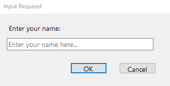
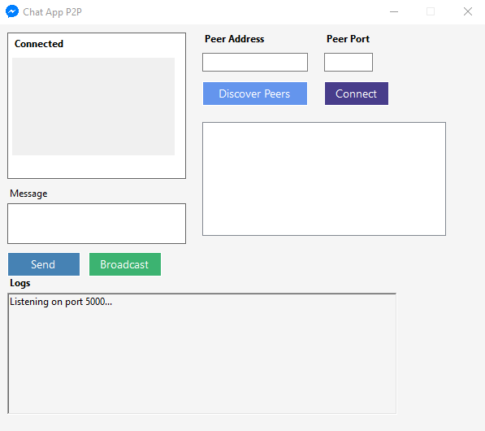

# Peer-to-Peer Chat Application

## Overview

This project is a Peer-to-Peer (P2P) Chat Application built with C# and .NET WinForms. The app allows users to discover peers, connect with them over TCP, and send/receive messages. It features custom peer discovery using UDP broadcasts and message exchange through serialized objects.

## Features

- **Peer Discovery:** Using UDP broadcasts, peers can discover each other on the same network.
- **Message Exchange:** Peers can send messages to specific connected peers or broadcast messages to all peers.
- **Named Peers:** Each peer can have a unique name that is displayed in the peer list.
- **Asynchronous Communication:** Message sending and receiving happen asynchronously, ensuring smooth communication between peers.

## Requirements

- .NET 6.0 SDK or later
- Visual Studio or any other C# IDE
- A local network for peer discovery (using UDP)

## Getting Started

### Prerequisites

Before running the application, ensure you have the following installed:

- .NET SDK 6.0 or later
- Visual Studio 2022 or any preferred IDE

### Clone the Repository

```bash
git clone git@github.com:yasser-mohamed1/Chat-Application-TCP-P2P-.git
```

### Build and Run

```bash
cd Chat-Application-TCP-P2P-/ChatApp\(PeertoPeer\)
dotnet build
dotnet run
```

## Folder Structure

```
ChatApp P2P/
│
├── ChatApp(PeertoPeer).sln
├── Forms/
│   ├── Form1.cs
│   └── Form1.Designer.cs
├── Models/
|   └── PeerMessage.cs
├── Networking/                  # Networking logic for peer discovery and communication
│   ├── Peer.cs
│   └── PeerDiscovery.cs
├── Utilities/
│   └── JsonMessageHandler.cs
├── Components/
|   └── InputDialog.cs
├── Assets/
├── Program.cs
├── README.md
└── .gitignore
```

## Class Overview

- Form1: Main form that manages the user interface, sending and receiving messages.
- Peer: Handles the network communication between peers via TCP.
- PeerDiscovery: Manages peer discovery using UDP broadcast.
- PeerMessage: Data model for messages sent between peers.
- JsonMessageHandler: Utility for serializing and deserializing PeerMessage objects.

## Usage

1. Enter Name: When you run the application, a dialog will ask for your name.
2. Discover Peers: Press the "Discover Peers" button to broadcast a discovery request over the network.
3. Connect to Peers: After discovering peers, select one and connect to them.
4. Send Messages: Once connected, you can send messages to the selected peer or broadcast messages to all peers.

## Example

- Start the application on two machines connected to the same network.
- Machine A sends a discovery request and Machine B responds.
- Machine A connects to Machine B.
- Both machines can exchange messages in real-time.

## Screenshots

## Input Name Dialog Screen



## Chat APP Screen



## Contributions

Contributions are welcome! Please feel free to submit a Pull Request with changes.

## Contact

For any questions or suggestions, feel free to contact me:

Email: y4ssermoh4med@gmail.com
